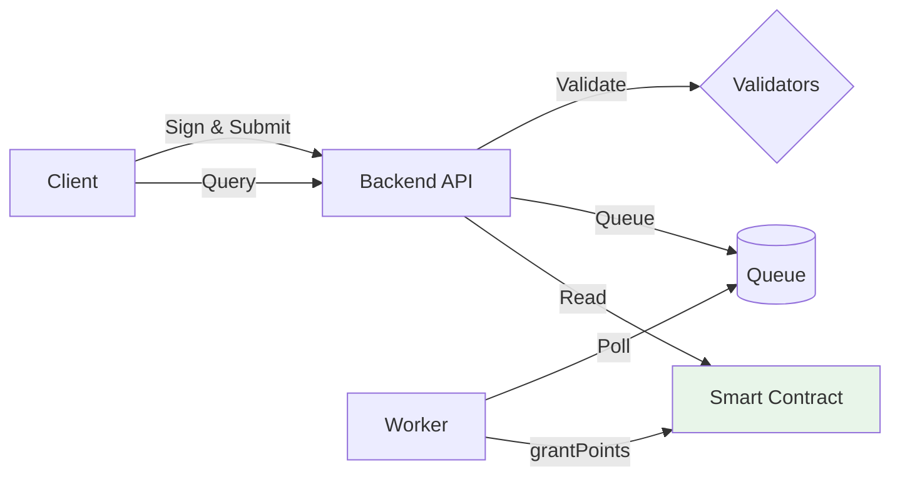

# VoyaGames Quest System

A blockchain-based quest system that stores quest points per wallet address on-chain to determine airdrop eligibility. The system validates off-chain quests and grants on-chain points through a secure, signature-based mechanism.

## Architecture Overview



**Components**:
1. **Smart Contract** - On-chain storage and point management
2. **Backend API** - Quest validation and job queuing
3. **Worker Service** - Batch processing of on-chain transactions (polls queue every 1 minute)

**Flow**: Client signs quest completion → Backend validates → Jobs queued → Worker processes → Points stored on-chain (max 1 minute delay)

## Smart Contract

**Deployed Contract**: `0xcaf786b1c6b65d1075be2329036d3c2b17779ffd` (Sepolia Testnet)

### Key Functions

```solidity
function grantPoints(address user, uint256 amount) external onlyOwner
function points(address user) external view returns (uint256)
function transferOwnership(address newOwner) external onlyOwner
```

### Features
- Owner-controlled point granting
- Point accumulation per wallet address
- Ownership transfer capability

## Backend API

### Endpoints

**POST /points** - Submit quest completion
```json
{
  "signature": "0x...",
  "message": {
    "wallet": "0x...",
    "quest_id": "daily-login-001",
    "quest_type": "daily",
    "timestamp": 1731617890348    
  }
}
```

**GET /points?wallet=0x...** - Retrieve wallet points

**Response**:
```json
{
  "wallet": "0x1234...",
  "points": "250"
}
```

*Note: Currently returns only on-chain points. Pending/queued points are not included.*

### Quest Validation Mechanism

The system uses a factory pattern to support multiple quest types:

```typescript
interface QuestValidator {
  validate(questId: string): Promise<boolean>
  getPoint(questId: string): Promise<number>
}
```

Each validator implements custom logic for verification and point calculation, allowing easy extension for new quest types.

### Security
- ECDSA signature verification
- Timestamp validation (30-second window prevents replay attacks)
- Idempotency (wallet + quest_id uniqueness)

### Supported Chains

The system currently supports the following networks (configured in `backend/src/config/chain.ts`):
- **sepolia** - Ethereum Sepolia Testnet
- **base-sepolia** - Base Sepolia Testnet
- **polygon-amoy** - Polygon Amoy Testnet
- **mainnet** - Ethereum Mainnet

To add support for additional chains, update the `resolveChain()` function in `backend/src/config/chain.ts` with the new chain configuration from `viem/chains`.


## Deployment Instructions

### Prerequisites
- Node.js 18+ and npm
- Hardhat
- Sepolia RPC URL (Alchemy/Infura)
- Private key for deployment

### 1. Deploy Smart Contract

```bash
cd contracts
npm install

# Create .env file with:
# SEPOLIA_RPC_URL=...
# SEPOLIA_PRIVATE_KEY=... (Owner of the contract)


npx hardhat run scripts/deploy.ts --network sepolia
# Note the deployed contract address
```

### 2. Setup Backend

```bash
cd backend
npm install

# Create .env file with:
# CONTRACT_ADDRESS=0x... (from deployment)
# RPC_URL=https://eth-sepolia.g.alchemy.com/v2/YOUR_KEY
# PRIVATE_KEY=0x...
# CHAIN=sepolia
# PORT=4000
```

### 3. Start Services

#### Option A: Using Docker (Recommended)

```bash
# Copy environment variables
cp .env.example .env
# Edit .env with your values

# Start both backend and worker
docker-compose up -d

# View logs
docker-compose logs -f

# Stop services
docker-compose down
```

#### Option B: Manual Setup

```bash
# Terminal 1: API server
npm run dev

# Terminal 2: Worker service
npm run worker
```

### 4. Test
You can edit these 2 following scripts to try and post curl requests to the server.
```bash
# Generate signed payload and submit
npx ts-node scripts/generateSignedPayload.ts

# Check points
npx ts-node scripts/getPoints.ts <wallet_address>
```

## Testing

### Smart Contract Tests
```bash
cd contracts
npx hardhat test  # 13 tests passing
```

### Backend Tests
```bash
cd backend
npm test  # 17 tests passing
```

## Proposal for Next Iteration

### 1. Scalability
- Replace JSON queue with Redis or PostgreSQL for production to support distributed workers
- Implement horizontal scaling for API servers
- **Retry Mechanism**: Add automatic retry logic in the worker for failed on-chain submissions (currently failed jobs are marked as failed without retry)

### 2. Enhanced User Experience
- **Pending Points**: Include queued (pending) points in the GET /points response, not just on-chain points. This would show users their total points including those waiting to be processed.

### 3. Gas Optimization
- **Batch Transactions**: Grant points to multiple users in one transaction
  ```solidity
  function batchGrantPoints(address[] users, uint256[] amounts) external onlyOwner
  ```

### 4. Advanced Quest System
- Store quest metadata on-chain or IPFS (Might not be needed at all, depends on our requirement)


### 5. Enhanced Security
- Rate limiting per wallet or some kind of fraud detection before submitting the queued transaction to chain.
- **Key Management**: Replace environment variable-based private keys with AWS KMS, Google Cloud KMS, etc for secure key storage and signing operations. 

